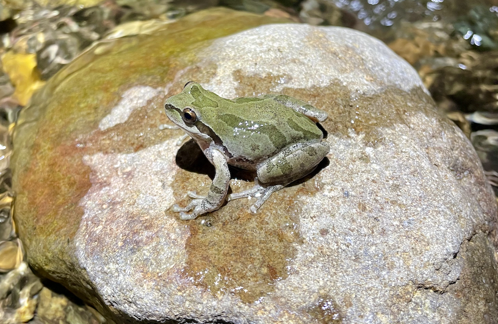
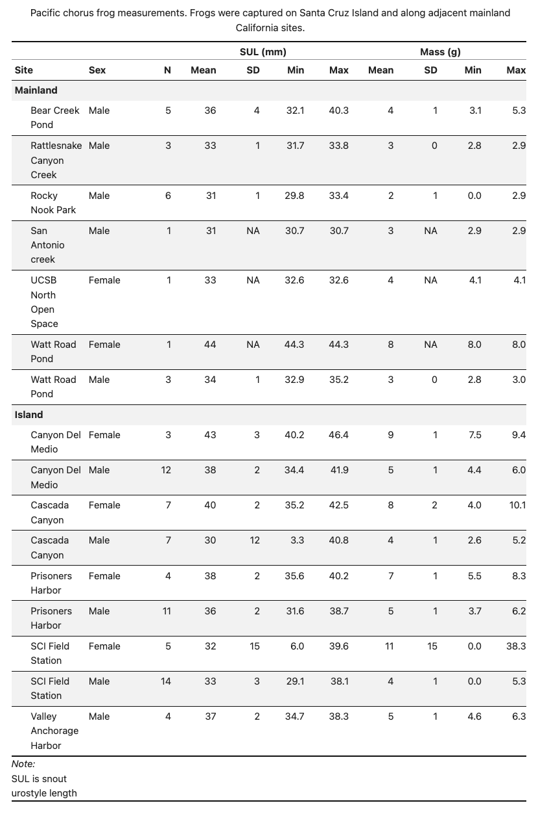

## Preamble

This lab focuses on cleaning and organizing ecological field data collected using Survey123. Because these data were collected during real fieldwork, the datasets contain inconsistent variable names, mixed formatting, missing values, and messy text entries. Students will use tidyverse tools to combine, clean, and analyze these data.

The dataset contains metadata, location information, habitat information, body measurements, and sample records for Pacific chorus frogs (*Pseudacris regilla*) collected on Santa Cruz Island and mainland California (San Luis Obispo County and Santa Barbara County). These data were collected as part of Sage Kruleski’s master’s thesis research investigating the colonization history and population structure of Pacific chorus frogs on the Channel Islands using genomic data.

Each row in the dataset represents one animal collected for tissue sampling, either an adult frog or a tadpole. Tissue samples and swab samples were collected to support both population genetics research and amphibian disease monitoring.

Survey123 is a commonly used field data collection application, making this dataset a realistic example of ecological field data. Because the data were collected under field conditions, the dataset contains many common QAQC (quality assurance / quality control) issues such as:
- inconsistent variable names
- missing values
- mixed text and numeric formatting
- date-time variables stored together
- inconsistent body mass entries
- multiple coordinate systems

This lab gives students experience cleaning authentic field data before performing analyses and visualizations.



### Selected Variables

- `globalId`: unique identifier automatically generated by Survey123
- `collectionDateAndTime`: date and time of collection stored in UTC format
- `latitudeManualGps` / `longitudeManualGps`: coordinates recorded with a handheld GPS
- `elevationM`: elevation recorded in meters
- `sulMm`: snout-urostyle length, a measurement of frog body length
- `totalMassG`: combined mass of the frog and collection bag
- `bagMassG`: mass of the collection bag
- `animalMassG`: frog body mass calculated from total mass and bag mass
- `waterTemperatureC`: water temperature recorded in Celsius
- `airTemperatureC`: air temperature recorded in Celsius
- `x` and `y`: coordinates automatically recorded by Survey123

## Load appropriate libraries

(Not all libraries are loaded that you will need)
```{r}
#| message: FALSE
library(dplyr)
library(tidyverse)
library(stringr)
```

## Loading in files
```{r}
#| message: FALSE
v1 <- read_csv("clean_p_regilla_V1_field_data.csv")
v2 <- read_csv("clean_p_regilla_V2_field_data.csv")
```

## Question 1: Combining and Joining Ecological Data

The files `clean_p_regilla_V1_field_data.csv` and `clean_p_regilla_V2_field_data.csv` were collected using different versions of the same Survey123 form. Before we can analyze the data, we need to clean the column names, make the two datasets use the same variable names, and combine them into one dataset.

***Question 1a:*** Clean the column names in both datasets.

**Hint:** Look into the function `rename_with()`. Camel case is useful! This will make the column names easier to work with in R.

```{r}
# code for Q1a
```

***Question 1b:*** The following code chunk creates the `Full` dataset. Use one of the dplyr mutating joins (not provided) to merge the two datasets.

**Note:** The merge will fail due to some columns having incompatible types. Locate which columns cause these issues and typecast them in the **v1** dataset.

```{r}
# Fix the columns that causes the errors, then run the join code cell again

```

```{r}
# code for Q1b
full <- v2 |>
  _join(v1, by = join_by(
      globalId, island, site, latitudeManualGps, longitudeManualGps, elevationM,
      sex, totalMassG, bagMassG, waterTemperatureC, x, y,
      collectionDateAndTime == creationDate, 
      sulMm == svlMm, 
      animalMassG == animalWeight, 
      airTemperatureC == airTemperatureC44,
      substrateType == substrate
    )
  )
```

Run this code to check you have joined the data correctly:
```{r}
dim(full)

glimpse(full)
```


## Question 2: Cleaning Date-Time Variables

The application used to record the data automatically logs the data and time in UTC, however the surveys take place in Coastal California. Fix the `collectionDateAndTime` column to match the correct time zone.

```{r}
# code for Q2
```

## Question 3: Prepare data frame for making summary table

***Question 3a:*** 
Tidy up site names. The correct names have been provided to you, use stringr syntax to clean corresponding row names

```{r}
# code for Q3a 
clean_names <- full |>
  mutate(
    site = case_when(
      str_detect(str_to_lower(site), "") ~ "San Antonio creek",
      str_detect(str_to_lower(site), "") ~ "UCSB North Open Space",
      str_detect(str_to_lower(site), "") ~ "Rattlesnake Canyon Creek",
str_detect(str_to_lower(site), "") ~ "Rocky Nook Park",
str_detect(str_to_lower(site), "") ~ "Hazard Creek Beach",
str_detect(str_to_lower(site), "") ~ "Cascada Canyon",
str_detect(str_to_lower(site), "") ~ "Prisoners Harbor",
str_detect(str_to_lower(site), "") ~ "Valley Anchorage Harbor",
str_detect(str_to_lower(site), "") ~ "Canyon Del Medio",
str_detect(str_to_lower(site), "") ~ "Watt Road Pond",
str_detect(str_to_lower(site), "") ~ "Trestle Beach",
str_detect(str_to_lower(site), "") ~ "Bear Creek Pond",
str_detect(str_to_lower(site), "") ~ "SCI Field Station",
str_detect(str_to_lower(site), "") ~ "SCI Field Station",
str_detect(str_to_lower(site), "") ~ "SCI Field Station",
      is.na(site) ~ "SCI Field Station",
      TRUE ~ "SCI Field Station"
    )
  )

```

***Question 3b:***
Continue to tidy up data table. Calculate animal mass for column `animalMassG`, remove NA and unknown values from `sex` column so that we are only looking at adult frogs. 

```{r}
# code for Q3b
```


## Question 4: Create function for calculating body measurements

Make a function named `frog_summary()` that takes a *dataframe* and user input columns to calculate measurement values (mean, sd, min, and max), count the sample size (n()), and renames columns from user-input columns.

**Hint:** Use a `group_by()` to prepare table that can be grouped by island, site, and sex. 
```{r}
# code for Q4

```

## Question 5: Create frog body measurement summary table

Your goal is to present a report - ready summary table displaying frog body measurements, grouped by locality (island vs mainland). Apply your function for calculating body measurements to display in the table (sd, mean, min, and max).

***Question 5a:*** 
First, make a prep table by applying the above function, group by island and mainland, and then ungroup so that the formatted table can include island and mainland as group headers but the column is *not* displayed in the table.


```{r}
# code for Q5a (prep table)

```

***Question 5b:***
Finally, create a table that shows mass and sul as table headers for corresponding columns and island and mainland as grouped headers for corresponding rows. Table should match the one below.

```{r}
# code for Q5b (formatted table)
```



## Question 6: Temperature conversion (functions)

Some columns measures temperature in Celsius, however for plotting and making the data more understandable, it is common to use Fahrenheit. Create a function that takes in the dataframe and using the columns containing Celsius values as inputs, convert those into Fahrenheit (we are creating a function since there are some columns that will be filled in later, such as dorsal and cloacal, that may want to be converted into the future).

The function `celsius_to_fahrenheit` should take in a *dataframe* and a column (that you want to convert) and outputs a *dataframe*.

**Note:** The new variable doesn't need to be defined, just update an existing one. 

```{r}
# code for Q6
```

Run the code below to test your function:
```{r}
full <- full |> 
  celsius_to_fahrenheit(c(waterTemperatureF = waterTemperatureC, airTemperatureF = airTemperatureC))
full |>
  select(waterTemperatureC, waterTemperatureF, airTemperatureC, airTemperatureF) |> 
  slice_head(n = 5) |> 
  kable()
```

## Question 7: Visualizing Frog Body Measurements

Use the cleaned dataset to explore differences in frog body measurements across regions and sexes.

Create a figure that compares body measurements across sexes and regions.

Your figure must:
- use `ggplot2`
- include labels and a title
- use faceting by either `site` or `sex`

```{r}
# code for Q7
```

***Question 7a:*** Write 1-2 sentences describing one pattern visible in your figure. Are there any surprising results?

## Question 8: Create a map of sampling locations

Using the latitude and longitude GPS data, map the observation on the California map that also shows the county lines. Use the columns `x` and `y`, not latitude/longitudeManualGPS. Remove any points that are inaccurate. 
```{r}
# code for Q8
```


