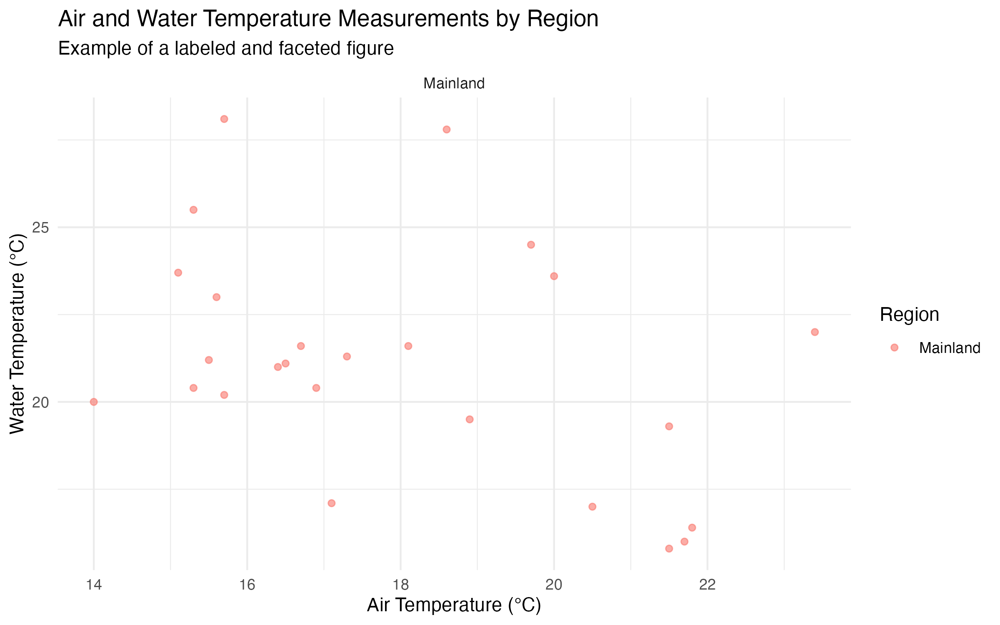

## Preamble

## Load appropriate libraries
```{r}
#| message: FALSE
library(dplyr)
library(tidyverse)
library(knitr)
library(maps)
library(mapproj)
library(kableExtra)
```

## Loading in files
```{r}
#| message: FALSE
v1 <- read_csv("clean_p_regilla_V1_field_data.csv")
v2 <- read_csv("clean_p_regilla_V2_field_data.csv")
```

## Question 1: Combining and Joining Ecological Data

The files `clean_p_regilla_V1_field_data.csv` and `clean_p_regilla_V2_field_data.csv` were collected using different versions of the same Survey123 form. Before we can analyze the data, we need to clean the column names, make the two datasets use the same variable names, and combine them into one dataset.

***Question 1a:*** Clean the column names in both datasets.

**Hint:** Look into the function `rename_with()`. Camel case is useful! This will make the column names easier to work with in R.

```{r}
# Q1a solution
v1 <- v1 |>
  rename_with(str_to_camel)
v2 <- v2 |>
  rename_with(str_to_camel)
```

***Question 1b:*** The following code chunk creates the `Full` dataset. Use one of the dplyr mutating joins (not provided) to merge the two datasets.

**Note:** The merge will fail due to some columns having incompatible types. Locate which columns cause these issues and typecast them in the **v1** dataset.

```{r}
# Q1b fix
v1 <- v1 |>
  mutate(latitudeManualGps = as.double(latitudeManualGps),
         waterTemperatureC = as.double(waterTemperatureC))
```

## Creating full dataset
```{r}
# Q1b solution
full <- v2 |>
  full_join(v1, by = join_by(
      globalId, island, site, latitudeManualGps, longitudeManualGps, elevationM,
      sex, totalMassG, bagMassG, waterTemperatureC, x, y,
      collectionDateAndTime == creationDate, 
      sulMm == svlMm, 
      animalMassG == animalWeight, 
      airTemperatureC == airTemperatureC44,
      substrateType == substrate
    )
  )
```

## Question 2: Cleaning Date-Time Variables

The application used to record the data automatically logs the data and time in UTC, however the surveys take place in Coastal California. Fix the `collectionDateAndTime` column to match the correct time zone.

```{r}
# Q2 solution
full <- full |>
  mutate(collectionDateAndTime = parse_date_time(collectionDateAndTime,
                                                 orders = c("mdy HMS", "mdy HM")),
  collectionDateAndTime = with_tz(collectionDateAndTime, 
                                   tzone = "America/Los_Angeles"))
```

## Question 3: Prepare data frame for making summary table

***Question 3a:*** 
Tidy up site names. The correct names have been provided to you, use stringr syntax to clean corresponding row names

```{r}
#step 1 = clean site names
clean_names <- full |>
  mutate(
    site = case_when(
      str_detect(str_to_lower(site), "san antonio") ~ "San Antonio creek",
      str_detect(str_to_lower(site), "ucsb") ~ "UCSB North Open Space",
      str_detect(str_to_lower(site), "rattlesnake") ~ "Rattlesnake Canyon Creek",
str_detect(str_to_lower(site), "rocky nook") ~ "Rocky Nook Park",
str_detect(str_to_lower(site), "hazard") ~ "Hazard Creek Beach",
str_detect(str_to_lower(site), "cascada") ~ "Cascada Canyon",
str_detect(str_to_lower(site), "prisoners") ~ "Prisoners Harbor",
str_detect(str_to_lower(site), "valley") ~ "Valley Anchorage Harbor",
str_detect(str_to_lower(site), "del") ~ "Canyon Del Medio",
str_detect(str_to_lower(site), "watt") ~ "Watt Road Pond",
str_detect(str_to_lower(site), "trestle") ~ "Trestle Beach",
str_detect(str_to_lower(site), "bear") ~ "Bear Creek Pond",
str_detect(str_to_lower(site), "field") ~ "SCI Field Station",
str_detect(str_to_lower(site), "1127") ~ "SCI Field Station",
str_detect(str_to_lower(site), "along creek") ~ "SCI Field Station",
      is.na(site) ~ "SCI Field Station",
      TRUE ~ "SCI Field Station"
    )
  )

```


***Question 3b:***
Continue to tidy up data table. Calculate animal mass for column `animalMassG`, remove NA and unknown values from `sex` column so that we are only looking at adult frogs. 
```{r}

#calculate animal mass, remove NA and unknown values for 'sex' so we are only looking at adult frogs
clean_names <- clean_names |> 
  mutate(animalMassG = totalMassG - bagMassG) |> 
 filter(!sex %in% c("UK", "Unknown")) |> 
  drop_na(sex)
unique(clean_names$sex)
```


## Question 4: Create function for calculating body measurements
Make a function named `frog_summary()` that takes a *dataframe* and user input columns to calculate measurement values (mean, sd, min, and max), count the sample size (n()), and renames columns from user-input columns.

**Hint:** Use a `group_by()` to prepare table that can be grouped by island, site, and sex. 
```{r}

frog_summary <- function(data, ..., summary_vars) {
  data |>
    group_by(...) |>
    summarise(
      across(
        {{ summary_vars }},
        list(
          mean = ~ mean(.x, na.rm = TRUE),
          sd = ~ sd(.x, na.rm = TRUE),
          min = ~ min(.x, na.rm = TRUE),
          max = ~ max(.x, na.rm = TRUE)
        ),
        .names = "{.col}_{.fn}"
      ),
      n = n()
    )
}
```

## Question 5: Create frog body measurement summary table
Your goal is to present a report - ready summary table displaying frog body measurements, grouped by locality (island vs mainland). Apply your function for calculating body measurements to display in the table (sd, mean, min, and max).

***Question 5a:*** 
First, make a prep table by applying the above function, group by island and mainland, and then ungroup so that the formatted table can include island and mainland as group headers but the column is *not* displayed in the table.
```{r}

#prep table by applying function, then ungrouping so table can include island and mainland as group headers
table_data <- clean_names |> 
  frog_summary(island, site, sex, summary_vars = c(sulMm, animalMassG)) |> 
  ungroup() |> 
  arrange(island, site)
```

***Question 5b:***
Finally, create a table that shows mass and sul as table headers for corresponding columns and island and mainland as grouped headers for corresponding rows. Table should match the one below.
```{r}
  
#create a table that shows mass and sul as table headers for columns and island and mainland for grouped headers for rows
table <- table_data |> 
  select(-island) |> 
   select(site, sex, n, everything()) |> 
  kable(digits = c(0, 1, 1, 0),
        col.names = c("Site", "Sex", "N", "Mean", "SD", "Min", "Max","Mean", "SD", "Min", "Max" ),
        caption = "Pacific chorus frog measurements. Frogs were captured on Santa Cruz Island and along adjacent mainland California sites.") |>
  kable_classic(full_width = F,
                bootstrap_options = "striped") |> 
  add_header_above(c(" " = 3, "SUL (mm)" = 4, "Mass (g)" = 4),
                   bold = TRUE) |> 
  pack_rows("Mainland",
            1,
            sum(table_data$island == "Mainland")) |> 
  pack_rows("Island",
            sum(table_data$island == "Mainland") + 1,
            nrow(table_data)) |> 
  row_spec(row = 0, bold = T, align = "c") |> 
  footnote(general = "SUL is snout urostyle length")

table
```

## Question 6: Temperature conversion (functions)

Some columns measures temperature in Celsius, however for plotting and making the data more understandable, it is common to use Fahrenheit. Create a function that takes in the dataframe and using the columns containing Celsius values as inputs, convert those into Fahrenheit (we are creating a function since there are some columns that will be filled in later, such as dorsal and cloacal, that may want to be converted into the future).

The function `celsius_to_fahrenheit` should take in a *dataframe* and a column (that you want to convert) and outputs a *dataframe*.

**Note:** The new variable doesn't need to be defined, just update an existing one. 
```{r}
# Q6 Solution
celsius_to_fahrenheit <- function(data, cols) {
  data |>
    mutate(across({{cols}}, ~ .x * 9/5 + 32))
}
```

Run the code below to test your function:
```{r}
full <- full |> 
  celsius_to_fahrenheit(c(waterTemperatureF = waterTemperatureC, airTemperatureF = airTemperatureC))
full |>
  select(waterTemperatureC, waterTemperatureF, airTemperatureC, airTemperatureF) |> 
  slice_head(n = 5) |> 
  kable()
```

## Question 7: Visualizing Frog Body Measurements
Use the cleaned dataset to explore differences in frog body measurements across regions and sexes.

Create a figure that compares body measurements across sexes and regions.

Your figure must:
- use `ggplot2`
- include labels and a title
- use faceting by either `site` or `sex`

```{r}

figure_data <- clean_names |>
  filter(!is.na(sex),
         !is.na(sulMm),
         !is.na(animalMassG),
         !is.na(island)) |>
  group_by(island, site, sex) |>
  summarise(
    avg_sul = mean(sulMm, na.rm = TRUE),
    avg_mass = mean(animalMassG, na.rm = TRUE),
    n = n(),
    .groups = "drop"
  )

ggplot(figure_data, aes(x = avg_sul, y = avg_mass, color = sex)) +
  geom_point(aes(size = n), alpha = 0.8) +
  facet_wrap(~ island) +
  labs(
    title = "Average Frog Body Size and Mass by Sex and Region",
    subtitle = "Each point represents one site and sex group",
    x = "Average SUL (mm)",
    y = "Average Animal Mass (g)",
    color = "Sex",
    size = "Sample Size"
  ) +
  theme_minimal()

```


```{r}

# Example figure (not part of the solution)

example_data <- full |>
  filter(
    !is.na(airTemperatureC),
    !is.na(waterTemperatureC),
    !is.na(island)
  )

ggplot(example_data,
       aes(x = airTemperatureC,
           y = waterTemperatureC,
           color = island)) +
  geom_point(alpha = 0.6) +
  facet_wrap(~ island) +
  labs(
    title = "Air and Water Temperature Measurements by Region",
    subtitle = "Example of a labeled and faceted figure",
    x = "Air Temperature (°C)",
    y = "Water Temperature (°C)",
    color = "Region"
  ) +
  theme_minimal()

ggsave("q7_example_figure.png", width = 8, height = 5)

```

***Question 7a:*** Write 1-2 sentences describing one pattern visible in your figure. Are there any surprising results?

> Mention that females on Santa Cruz island appear to be an outlier. There is a positive trend between animal average mass and average SUL. Males tend to be smaller on average than females. 

## Question 8: Create a map of sampling locations

Using the latitude and longitude GPS data, map the observation on the California map that also shows the county lines. Use the columns `x` and `y`, not latitude/longitudeManualGPS. Remove any points that are inaccurate. 

> When plotting the GPS points, one observation recorded (0,0) is not a valid point. Users must get rid of this datapoint somehow. How the map is created is free to the user. An alpha is incorporated so that overlaps of points are explicit

```{r}
# Q8 Solution

county <- map_data("county")
ca <- filter(county, region == "california")

ggplot(data = ca) +
  geom_polygon(aes(x = long, y = lat, group = group), fill = "white", color = "grey25", linewidth = 0.1) +
  coord_map() +
  geom_point(data = filter(full, y > 0), aes(x = x, y = y), color = "steelblue", alpha = 0.1) +
  xlab("") + ylab("") +
  theme(plot.title = element_text(hjust = 0.5),
        panel.border = element_blank(),
        panel.grid.major = element_blank(),
        panel.grid.minor = element_blank(),
        axis.text = element_blank(),
        axis.ticks = element_blank(),
        legend.position = "none",
        plot.margin = margin(0, 0, 0, 0, "cm"))
```


## References
- [Creating Date/Time objects with inconsistent formats](https://www.r-bloggers.com/2024/09/mastering-date-and-time-data-in-r-with-lubridate/#:~:text=Solving%20Real%2DWorld%20Date%2DTime%20Issues)
- [Renaming Columns Headers](https://www.statology.org/r-rename_with/)
- [Mapping California](https://www.linkedin.com/learning/data-visualization-in-r-with-ggplot2-24583012/zooming-in-on-california)
